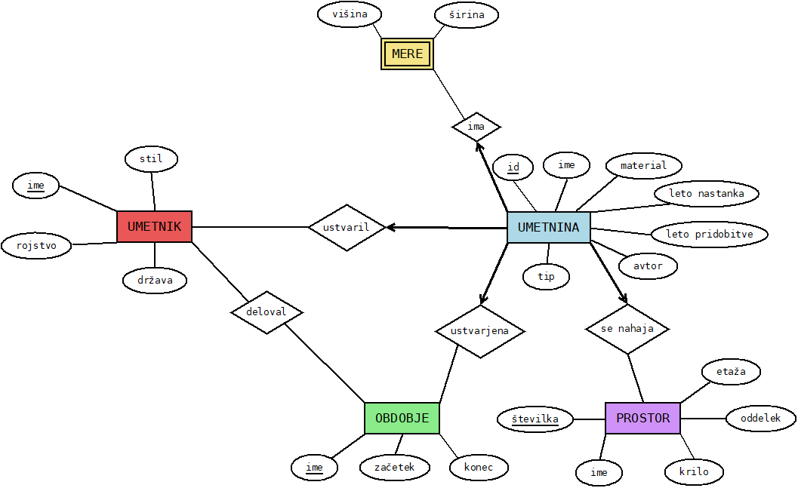

# eMuzej
## Projekt pri OPB

eMuzej je podatkovna baza, namenjena pregledovanju umetnin treh bolj znanih svetovnih muzejev:
* Louvre,
* Metropolitan Museum of Art,
* British Museum.

Baza nelogiranim uporabnikom omogoča pregledovanje med umetninami, umetniki in obdobji kot prikazuje spodnji diagram. Logirani uporabniki pa imajo možnost dodajanja, urejanja in odstranjevanja posameznih objektov.

